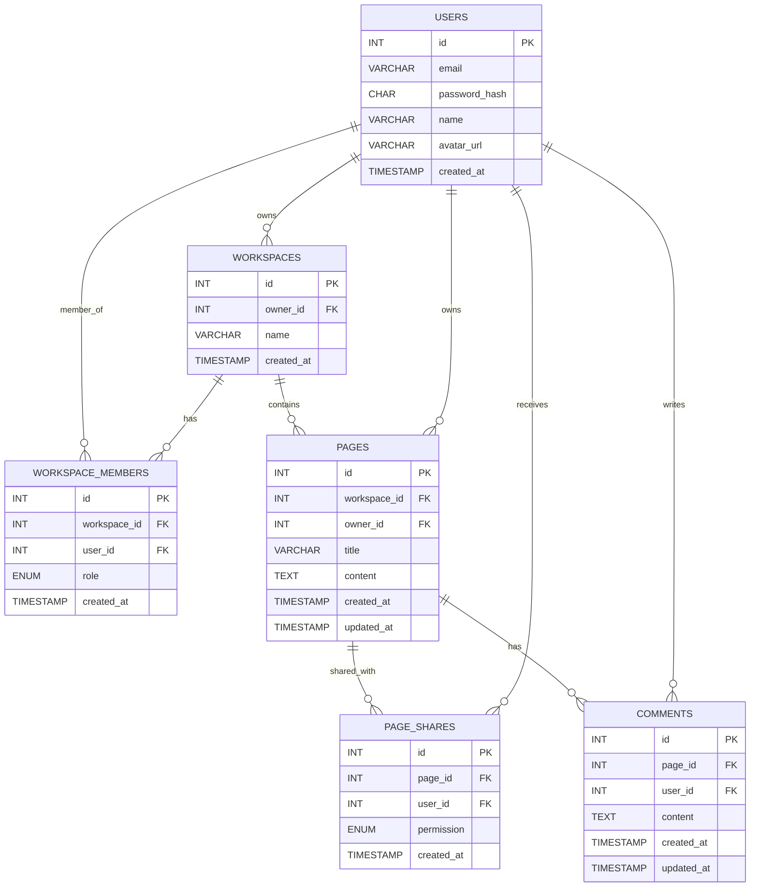

# Workspace App

Application web collaborative de gestion de contenu — workspaces, pages, commentaires et invitations. Construite en PHP natif, MySQL et JavaScript vanilla, sans frameworks.

## Fonctionnalités

- Authentification par sessions PHP (inscription, connexion, déconnexion)
- CRUD complet sur les workspaces et les pages
- Collaboration : invitation de membres avec rôles (viewer, editor, admin)
- Commentaires sur les pages avec modération par l'owner
- Dashboard avec statistiques agrégées et activité récente
- API REST — 30+ routes, codes HTTP sémantiques
- Suite de tests d'intégration — 22 tests, 56 assertions

## Stack technique

| Couche | Technologie | Décision |
|--------|-------------|----------|
| Conteneurisation | Docker Compose | Lancement reproductible en une commande |
| Backend | PHP 8.3 natif | Comprendre le cycle HTTP sans abstraction |
| Base de données | MySQL 8 | Relations, index, agrégations SQL |
| Frontend | JavaScript vanilla | DOM, Event Loop, Fetch API, gestion d'état manuelle |
| Auth | Sessions PHP + bcrypt | Stateful, adapté à un frontend sur le même domaine |
| Tests | PHPUnit 12 | Tests d'intégration HTTP sur DB dédiée |

## Architecture
```
workspace-app/
├── public/
│   └── index.php          # Front Controller — point d'entrée unique
├── backend/
│   ├── config/
│   │   └── Database.php   # Singleton PDO, utf8mb4, requêtes préparées
│   ├── controllers/       # Logique HTTP — validation, réponses
│   ├── middleware/
│   │   └── AuthMiddleware.php  # Vérifie la session avant les routes protégées
│   ├── models/            # Requêtes SQL — aucune logique HTTP
│   └── Router.php         # Routing par regex, support {params} dynamiques
├── frontend/
│   ├── js/
│   │   ├── api.js         # Couche fetch + gestion du loader (DOM minimal)
│   │   ├── state.js       # Source de vérité unique de l'UI
│   │   ├── ui.js          # Fonctions render* — aucun fetch
│   │   └── app.js         # Orchestration — events, state, api, ui
│   └── css/
├── database/
│   └── workspace_app.sql  # Schéma complet avec FK, index, contraintes
├── Dockerfile             # Image PHP 8.3 + extensions PDO MySQL
├── docker-compose.yml     # Services app + db
└── tests/
    └── Integration/       # Tests HTTP sur DB dédiée
```

## Modèle de données


Décision notable : `ON DELETE CASCADE` sur les dépendances de workspace (pages, commentaires, membres, partages). Supprimer un workspace nettoie ses pages/commentaires et ses membres. Supprimer un user supprime ses memberships/partages/commentaires, mais ses workspaces/pages passent avec `owner_id = NULL` (pas de cascade). Choix conscient pour la simplicité (alternative : anonymisation pour la conformité RGPD).

## Sécurité

- Mots de passe hashés avec bcrypt (cost par défaut de PHP 8.3 = 10, non surchargé)
- Requêtes préparées PDO sur toutes les opérations DB — protection injections SQL
- `session_regenerate_id()` après chaque connexion — protection session fixation
- Cookie de session `HttpOnly` : dépend de `php.ini` (recommandé `session.cookie_httponly=1` si pas déjà activé)
- Messages d'erreur login volontairement vagues — prévention énumération users
- Contrôle d'accès vérifié à chaque route : authentification → existence ressource → autorisation

## Installation Docker

**Prérequis** : Docker et Docker Compose

```bash
git clone https://github.com/rommy-dev/workspace-app
cd workspace-app

# Configure l'environnement pour l'application et Docker Compose
cp backend/.env.example backend/.env
cp backend/.env.example .env

# Lance l'application et la base de données
docker compose up --build
```

L'application est disponible sur :

```txt
http://localhost:8080
```

Le conteneur `db` initialise automatiquement MySQL avec `database/workspace_app.sql` au premier démarrage. Les variables `MYSQL_*` du fichier `.env` racine sont utilisées par `docker-compose.yml`, tandis que les variables `DB_*` sont utilisées par le backend PHP.

En mode Docker, garde cette logique :

```bash
DB_HOST=db
DB_PORT=3306
```

Si la base doit être recréée depuis zéro, supprime le volume Docker :

```bash
docker compose down -v
docker compose up --build
```

## Services Docker

| Service | Rôle | Port |
|---------|------|------|
| `app` | Serveur PHP exposant `public/` | `8080` |
| `db` | MySQL 8 avec initialisation automatique | `3307` côté machine, `3306` côté Docker |

## Tests

```bash
docker compose exec app ./vendor/bin/phpunit --testdox
```

## Décisions techniques

**Pourquoi PHP natif sans framework ?** Comprendre ce que Laravel et Symfony font sous le capot : routing par regex, Front Controller, PDO, middleware chain. Ces abstractions sont utiles mais opaques si on ne les a jamais implémentées.

**Pourquoi les sessions plutôt que JWT ?** Le frontend consomme l'API depuis le même domaine. Les sessions sont plus simples, le cookie est `HttpOnly` (inaccessible au JS), et invalider une session côté serveur est immédiat. JWT brille pour les APIs consommées par des tiers ou dans une architecture microservices.

**Pourquoi les tests d'intégration plutôt qu'unitaires ?** Les tests unitaires des Controllers nécessiteraient de refactoriser pour injecter les dépendances — un chantier qui n'apporte pas de valeur ici. Les tests d'intégration HTTP couvrent toute la stack (routing → controller → model → DB) et vérifient les vrais comportements.
